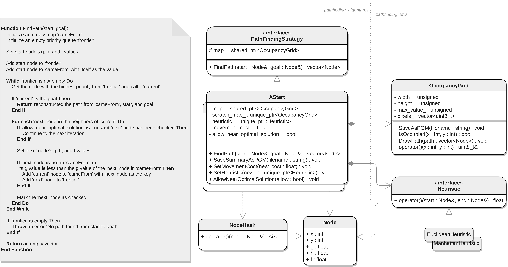

# Pathfinding Algorithms in C++

This repository contains an implementation of the A* search algorithm in C++. The goal of this code is to find an optimal (or near-optimal) path in terms of distance between two points on a map imported from a `.pgm` file.

## Getting Started

To use this project, follow these steps to build it:

```bash
mkdir build

# If you don't need to build the tests, you can omit the BUILD_TESTING flag.
cmake -S . -B ./build -DBUILD_TESTING=ON 

make -C ./build
```

After building the project, you can run the binary by navigating to the build directory and executing the binary file. Here's how you can do it:

```bash
cd ./build
./task_1 "../maps/map_2.pgm" 2 2 20 2 
```

Alternatively, you can use a different map and start/end points:

```bash
cd ./build
./task_1 "../maps/its.pgm" 100 300 3400 1500
```

If you have previously built the tests, you can run them by navigating to the build directory and executing the `ctest` command:

```bash
cd ./build
ctest
```

## Code Structure & Features

The architecture outlined above supports the use of pre-existing pathfinding A* algorithm, as well as the development of custom solutions using the same interface.



## Results

This A* implementation allows a node, once reached and removed from the `frontier`, to be added back if a less costly path is found. This is crucial to ensure the returned path is the best possible when the heuristic function is admissible but not consistent. If the heuristic is consistent, the path to a node removed from the `frontier` is guaranteed to be the most efficient. The main goal of this task is to implement an efficient pathfinding algorithm. However, to decrease execution time, an enhancement is available that provides a solution that is generally satisfactory and at worst, slightly less than the best. When enabled, this enhancement avoids revisiting previously checked nodes, significantly reducing computation time. However, it does not guarantee the best solution as the algorithm will stop exploring other paths once it finds a path to the goal.

|                          Method | Execution Time (ms) | Nodes Inspected | Result File                                                                               |
| ------------------------------: | :-----------------: | :-------------: | ----------------------------------------------------------------------------------------- |
|         Euclidean Best Solution |        50432        |     4880852     | [its_euclidean_best_solution.pgm](./docs/its_euclidean_best_solution.pgm)                 |
|         Manhattan Best Solution |        35559        |     4229139     | [its_manhattan_best_solution.pgm](./docs/its_manhattan_best_solution.pgm)                 |
| Manhattan High-Quality Solution |        16728        |     801426      | [its_manhattan_high_quality_solution.pgm](./its_docs/manhattan_high_quality_solution.pgm) |
| Euclidean High-Quality Solution |        53057        |     1259062     | [its_euclidean_high_quality_solution.pgm](./its_docs/euclidean_high_quality_solution.pgm) |

There are several strategies available to enhance the efficiency and computational performance of the A* algorithm. This implementation provides the flexibility to adjust the cost of movement between two neighboring cells. As the cost of movement between cells decreases, the heuristic's influence on the decision-making process intensifies. This directly enhances the overall performance of the pathfinding process, as fewer cells are evaluated. Another approach is to redefine a neighbour node as a cell that is, for example, 3 pixels away (define chunks of pixels), rather than a directly adjacent cell. This reduces the number of nodes the algorithm needs to inspect, potentially significantly improving execution time. Another strategy is to use the squared Euclidean distance `dx^2 + dy^2` instead of the standard Euclidean distance formula `sqrt(dx^2 + dy^2)`. This eliminates the need for a computationally expensive square root operation, thereby reducing the algorithm's computational demand.

Please note that while these improvements may not always yield the best path, they can provide high-quality solutions much more quickly.
